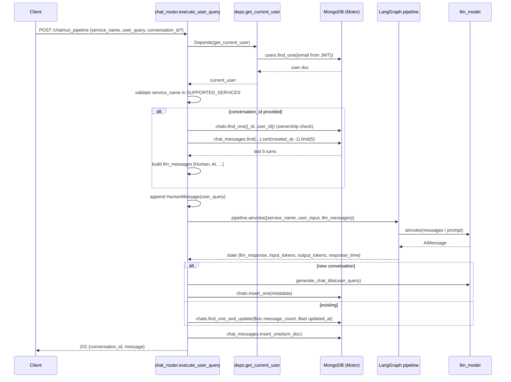
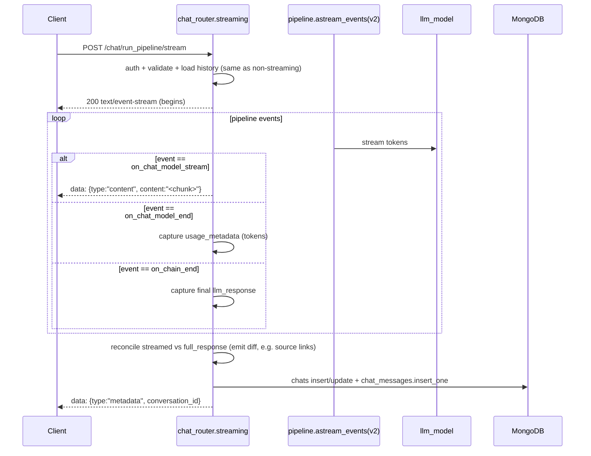
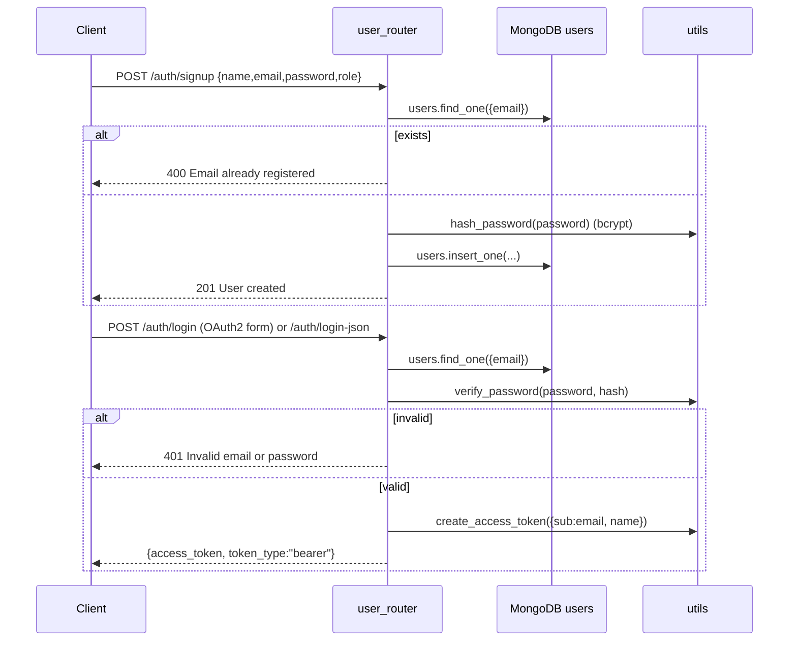
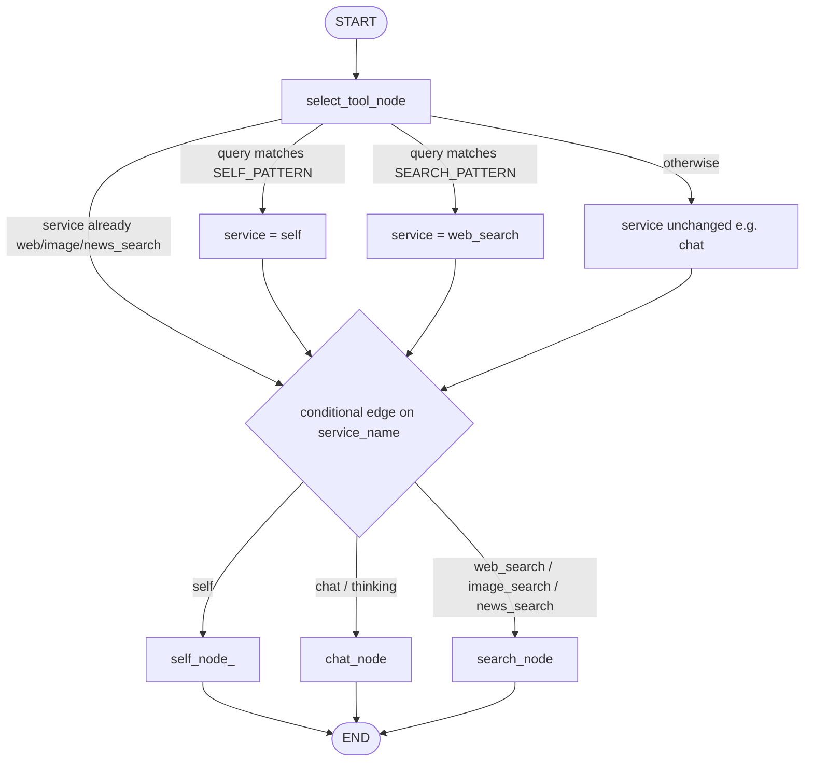

# 03 — System Design & Data Flow

[← Back to Index](index.md)

This document traces how data moves through the system for the major use cases, with sequence diagrams (Mermaid) and flow diagrams.

---

## 1. Non-streaming chat request

Endpoint: `POST /chat/run_pipeline` → handler `execute_user_query` (`src/api_router/chat_router.py`).



### Step-by-step
1. **Auth** — `get_current_user` decodes the JWT, extracts `sub` (email), and loads the user from MongoDB.
2. **Service validation** — `service_name` must be in `cfg["Services"]["SUPPORTED_SERVICES"]` (`chat`, `web_search`, `thinking`, `image_search`, `news_search`).
3. **History load** — if `conversation_id` is supplied, ownership is verified, then the **last 5 turns** are fetched (newest-first, then reversed to chronological) and expanded into alternating `HumanMessage` / `AIMessage` objects.
4. **Pipeline invocation** — `pipeline.ainvoke(...)` runs the LangGraph (see [12 — Pipeline](12-pipeline.md)).
5. **Persistence** — new conversations get an LLM-generated title and a `chats` document; existing ones are atomically updated (`message_count++`, `updated_at`). The turn is written to `chat_messages` with token/latency metrics and a `seq` number.
6. **Response** — `{conversation_id, message}`.

---

## 2. Streaming chat request (Server-Sent Events)

Endpoint: `POST /chat/run_pipeline/stream` → handler `execute_user_query_streaming`.



### SSE event protocol
The stream emits newline-delimited `data: <json>` frames. Frame `type` values:

| `type` | Payload | Meaning |
|--------|---------|---------|
| `content` | `{type, content}` | An incremental token/chunk of the answer |
| `metadata` | `{type, conversation_id}` | Final frame after the turn is persisted |
| `error` | `{type, detail}` | An error during streaming or DB save |

**Reconciliation detail:** search nodes append a `**Sources:**` link block to `llm_response` that is *not* streamed token-by-token. After streaming ends, the handler compares `full_response` (from `on_chain_end`) with `streamed_response` and emits the trailing **diff** as one final `content` frame so the client receives the links.

---

## 3. Authentication & login flow



See [09 — Authentication & Authorization](09-authentication.md) for OTP password reset and RBAC.

---

## 4. Tool-routing decision flow (inside the pipeline)



- `SELF_PATTERN` matches identity questions ("who are you", "what is your name", …) → `self_node` answers as **SannaAI**.
- `SEARCH_PATTERN` matches time-sensitive keywords ("current", "today", "latest", "news", "weather", "price", "stock", "score", "live", "who is") → upgrades the service to `web_search`.
- Otherwise the request flows to `chat_node` (plain LLM call with full message history).

---

## 5. End-to-end data lifecycle of a conversation

```
signup ──> login (JWT) ──> POST /chat/run_pipeline (no conversation_id)
                               │
                               ├─ pipeline answers
                               ├─ chats.insert_one  (title auto-generated)
                               └─ chat_messages.insert_one (seq=1)
                                       │
            POST /chat/run_pipeline (conversation_id) ──► loads last 5 turns
                                       │                    chats.$inc message_count
                                       └─ chat_messages.insert_one (seq=N)
                                       │
            GET /chat/conversations            ──► list (sorted by updated_at desc)
            GET /chat/conversations/{id}        ──► full thread (messages sorted asc)
            PUT /chat/conversations/{id}/rename ──► change title
            DELETE /chat/conversations/{id}     ──► delete chat + its messages
            DELETE /auth/delete-user            ──► cascade delete user+chats+messages
```

---

Next: [04 — Technology Stack & Dependencies →](04-tech-stack.md)
