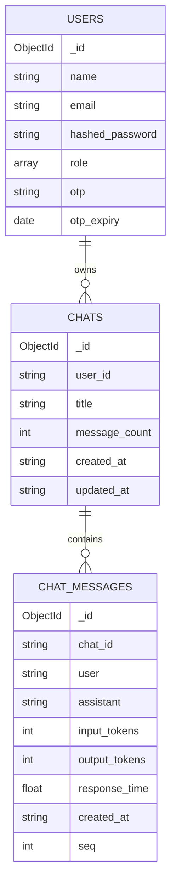

# 08 — Database Schema & Models

[← Back to Index](index.md)

## Database

- Engine: **MongoDB**, accessed asynchronously via **Motor**.
- Connection: `mongodb://localhost:27017` (configurable; `MONGO_URL`).
- Database name: `ai_chat_app` (`DB_NAME`).
- Client is timezone-aware (`tz_aware=True, tzinfo=UTC`).

There is **no migration system** and **no enforced schema** — MongoDB is schemaless and the application defines document shapes implicitly through its insert/update code. Referential integrity (cascading deletes) is enforced in application code, not the database.

## Collections

| Logical name | Config key | Collection | Purpose |
|--------------|-----------|------------|---------|
| Users | `USER_COLLECTION` | `users` | Accounts, credentials, roles, OTP state |
| Conversations | `CHAT_HISTORY_COLLECTION` | `chats` | Conversation metadata (one per thread) |
| Messages | `MESSAGES_COLLECTION` | `chat_messages` | Individual turns (one doc per user+assistant exchange) |

This **dual-collection** design (conversations decoupled from messages) keeps listing cheap and avoids unbounded growth of a single document.

---

## `users` document

```jsonc
{
  "_id": ObjectId("..."),
  "name": "Jane",
  "email": "jane@example.com",          // unique by application convention
  "hashed_password": "$2b$12$...",      // bcrypt hash
  "role": ["ROLE_USER"],                // or ["ROLE_USER","ROLE_ADMIN"]
  // Present only during a password-reset window:
  "otp": "482913",                      // 6-digit, set by /auth/forget-password
  "otp_expiry": ISODate("...")          // now + 5 minutes; unset after reset
}
```

- Created by `POST /auth/signup`.
- `otp` / `otp_expiry` are added by `forget_password` and **`$unset`** by `verify_otp_reset_password`.
- Uniqueness of `email` is **not** enforced by a DB index — the signup handler checks for an existing user first. *(Recommended: add a unique index — see [14 — Security](14-security.md) and [19 — Performance](19-performance.md).)*

---

## `chats` document (conversation metadata)

```jsonc
{
  "_id": ObjectId("..."),               // conversation_id (stringified in API)
  "user_id": "507f1f77bcf86cd799439011",// str(user._id) — owner
  "title": "Explain async IO",          // 1–60 chars; auto-generated on first turn
  "message_count": 3,                   // incremented per turn; also used as seq source
  "created_at": "2026-06-08T10:00:00+00:00", // ISO-8601 string
  "updated_at": "2026-06-08T10:05:00+00:00"
}
```

- `created_at` / `updated_at` are stored as **ISO-8601 strings** (`datetime.now(UTC).isoformat()`), not BSON dates.
- `message_count` is bumped atomically with `find_one_and_update($inc)` and reused as the `seq` for the new turn.

---

## `chat_messages` document (a turn)

```jsonc
{
  "_id": ObjectId("..."),
  "chat_id": "665f...c2",               // STRING form of the conversation _id
  "user": "Explain async IO",           // the user's message
  "assistant": "Async IO lets ...",     // the assistant's reply (incl. source links)
  "input_tokens": 128,
  "output_tokens": 412,
  "response_time": 1.732,               // seconds
  "created_at": "2026-06-08T10:05:00+00:00",
  "seq": 3                              // ordering within the conversation
}
```

- **Important:** `chat_id` is the **string** form of the conversation `ObjectId`. All message queries use the string (e.g. `messages_collection.find({"chat_id": conversation_id})`). The cascade-delete code explicitly converts ObjectIds to strings before matching messages.
- Token/latency fields default to `0` / `0.0` when the provider doesn't report usage metadata.

---

## Pydantic models (`src/schemas.py`)

These validate inbound requests and shape outbound responses. They mirror — but are not identical to — the stored documents.

### Auth / user
| Model | Fields |
|-------|--------|
| `UserCreate` | `name` (1–20, default "New User"), `email: EmailStr`, `password` (≥6), `role: list[str]` (default `["ROLE_USER"]`) |
| `UserLogin` | `email: EmailStr`, `password` (≥6) |
| `Token` | `access_token: str`, `token_type: str = "bearer"` |
| `ResetPasswordRequest` | `old_password` (≥6), `new_password` (≥6) |
| `UpdateUserNameRequest` | `new_name` (1–20) |
| `ForgotPasswordRequest` | `email: EmailStr` |
| `ResetPasswordWithOTP` | `email: EmailStr`, `otp: str`, `new_password` (≥6) |

### Conversation / message
| Model | Fields |
|-------|--------|
| `Message` | `id`, `chat_id`, `user`, `assistant`, `input_tokens`, `output_tokens`, `response_time`, `created_at`, `seq` |
| `ConversationBase` | `title` (1–60, default "New Chat"; `None`→default via validator) |
| `ConversationCreate` / `ConversationUpdate` | inherit `ConversationBase` |
| `Conversation` | `ConversationBase` + `id`, `user_id`, `messages: list[Message]`, `message_count`, `created_at`, `updated_at` |

### Pipeline I/O
| Model | Fields |
|-------|--------|
| `UserInput` | `service_name: str = "chat"`, `user_query: str`, `conversation_id: str | None` |
| `UserQueryResponse` | `conversation_id: str`, `message: str` |

The `serialize_conversation()` helper in `chat_router.py` maps a Mongo document (with `ObjectId _id`) to the `Conversation` model (with string `id`).

---

## Entity relationship (logical)



Relationships are **by reference, in application code**: `chats.user_id == str(users._id)` and `chat_messages.chat_id == str(chats._id)`.

---

## Indexing notes (current state & recommendations)

The codebase does not create any indexes. Hot query paths that would benefit:

| Query | Suggested index |
|-------|-----------------|
| `users.find_one({email})` (login/auth, every request) | unique index on `email` |
| `chats.find({user_id}).sort(updated_at, -1)` | compound `{user_id:1, updated_at:-1}` |
| `chat_messages.find({chat_id}).sort(created_at, …)` | compound `{chat_id:1, created_at:1}` |

See [19 — Performance](19-performance.md).

---

Next: [09 — Authentication & Authorization →](09-authentication.md)
