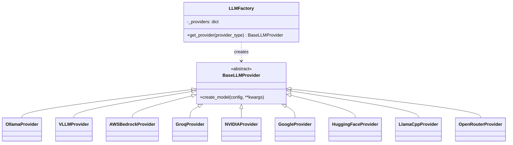

# 11 — LLM Provider Layer & Integrations

[← Back to Index](index.md)

The LLM layer (`src/llms/`) is the project's most reusable abstraction. It lets the rest of the app call **one** `llm_model` object regardless of which of the 9 providers is configured.

## Design: Factory + Strategy + Singleton



- **`BaseLLMProvider`** (`base.py`) — abstract base with a single method `create_model(self, config: dict, **kwargs)`.
- **`LLMFactory`** (`llm_factory.py`) — maps a lowercase provider name to its class via a `_providers` dict; `get_provider(name)` raises `ValueError` for unknown providers.
- Each concrete provider wraps the matching LangChain chat model.

## Wiring (`src/clients/llm_client.py`)

```python
def get_llm_model():
    inference_type = cfg["LLM"]["Provider"].lower()      # e.g. "ollama"
    provider = LLMFactory.get_provider(inference_type)    # -> OllamaProvider()
    kwargs = {
        "aws_key":   os.getenv("AWS_ACCESS_KEY_ID"),
        "aws_secret":os.getenv("AWS_SECRET_ACCESS_KEY"),
        "api_key":   os.getenv(f"{inference_type.upper()}_API_KEY") or ...fallbacks...,
    }
    return provider.create_model(cfg["LLM"][inference_type], **kwargs)

llm_model = get_llm_model()    # singleton, built at import
```

The resulting `llm_model` is imported by the pipeline nodes and by `generate_chat_title`.

## Provider catalog

| Provider key | Class | LangChain wrapper | Auth | Key config keys |
|--------------|-------|-------------------|------|-----------------|
| `ollama` | `OllamaProvider` | `ChatOllama` | none (local/cloud URL) | `MODEL`, `BASE_URL`, `TEMPERATURE`, `REASONING_EFFORT`*, `MODEL_TYPE` |
| `vllm` | `VLLMProvider` | `ChatOpenAI` | `API_KEY` (often `"EMPTY"`) | `MODEL`, `API_KEY`, `BASE_URL`, `TEMPERATURE`, `REASONING_EFFORT`*, `MODEL_TYPE` |
| `aws_bedrock` | `AWSBedrockProvider` | `ChatBedrockConverse` | AWS keys | `MODEL`, `AWS_REGION`, `TEMPERATURE`, `REASONING_EFFORT`*, `MODEL_TYPE` |
| `groq` | `GroqProvider` | `ChatGroq` | `api_key` | `MODEL`, `TEMPERATURE`, `REASONING_EFFORT`*, `MODEL_TYPE` |
| `nvidia` | `NVIDIAProvider` | `ChatNVIDIA` | `api_key` | `MODEL`, `TEMPERATURE` |
| `google` | `GoogleProvider` | `ChatGoogleGenerativeAI` | `api_key` | `MODEL`, `TEMPERATURE`, `MAX_RETRIES` |
| `huggingface` | `HuggingFaceProvider` | `ChatHuggingFace`+`HuggingFaceEndpoint` | `api_key` (HF token) | `MODEL`, `MODEL_TYPE` (task), `MAX_TOKENS`, `PROVIDER`, `STREAMING` |
| `llamacpp` | `LlamaCppProvider` | `ChatLlamaCpp` | none (local file) | `MODEL` (path), `TEMPERATURE`, `N_CTX`, `N_GPU_LAYERS`, `N_BATCH`, `MAX_TOKENS`, `REPEAT_PENALTY`, `TOP_P`, `VERBOSE` |
| `open_router` | `OpenRouterProvider` | `ChatOpenRouter` | `api_key` | `MODEL`, `TEMPERATURE`, `MAX_TOKENS`, `MAX_RETRIES`, `REASONING_EFFORT`*, `MODEL_TYPE` |

`*` `REASONING_EFFORT` is only passed when `MODEL_TYPE == "reasoning"`, otherwise `None`.

### Reasoning toggle pattern
Most providers use:
```python
reasoning_effort = config["REASONING_EFFORT"] if config.get("MODEL_TYPE") == "reasoning" else None
```
- **Ollama / vLLM / Groq** pass it as `reasoning_effort=...`.
- **AWS Bedrock** passes it inside `additional_model_request_fields={"reasoning_effort": ...}`.
- **OpenRouter** builds a `reasoning` dict `{effort, max_tokens:1000, enabled:False, exclude:True}`.

> 🐞 **Known bug in `open_router.py`:** `effort` is assigned only inside the `if MODEL_TYPE == "reasoning":` block, but the `reasoning_config` dict that references `effort` is built **outside** that block. If `MODEL_TYPE != "reasoning"`, `effort` is undefined → `NameError`. With the committed config (`MODEL_TYPE: "reasoning"`) it works, but a non-reasoning OpenRouter config would crash. Fix: initialize `effort` with a default before the dict, or move the dict inside the `if`.

## Response normalization (`llm_parser.py`)

```python
def parse_response(llm_response, inference_type=default_inference_type) -> AIMessage:
    if inference_type == "openai":
        # extract choices[0].message.content, reasoning_content, usage
    elif inference_type == "aws_bedrock":
        # content[1].text, content[0].reasoning_content.text, usage_metadata
    else:
        return llm_response   # LangChain types already return AIMessage-like objects
```

- For **LangChain-native** providers (ollama, vllm, groq, google, huggingface, nvidia, open_router, llamacpp), the raw response is returned unchanged — it already exposes `.content` and `.response_metadata` / `.usage_metadata`.
- For `openai` and `aws_bedrock`, the parser reshapes the provider-specific structure into a uniform `AIMessage(content, additional_kwargs, response_metadata)`.
- `default_inference_type` is read from `config.yml` at import; callers can override via the `inference_type` argument.

The pipeline nodes then read `parsed_response.content` and (when present) `parsed_response.response_metadata` for `input_tokens` / `output_tokens`.

## Adding a new provider — checklist

1. Create `src/llms/<name>.py` with a class extending `BaseLLMProvider` and implementing `create_model(config, **kwargs)` returning a LangChain chat model.
2. Register it in `LLMFactory._providers` (`llm_factory.py`) and export it from `src/llms/__init__.py`.
3. Add a `<name>:` block under `LLM:` in `config.yml` with all keys your `create_model` reads.
4. Add the relevant API key to `.env` (matching the `{NAME}_API_KEY` pattern, or extend the fallback in `llm_client.py`).
5. If the provider's response shape isn't LangChain-standard, add a branch in `parse_response`.
6. Set `LLM.Provider: "<name>"` and restart.

## External service: DuckDuckGo search (`ddgs`)

Used in `search_node` (not a "provider" but an external integration):
- `DDGS().text(query, region="in-en", max_results=5)` — web search.
- `DDGS().images(query, region="in-en", safesearch="off", timelimit="m", max_results=4)` — images.
- `DDGS().news(query, region="in-en", safesearch="off", timelimit="m", max_results=5)` — news.

Results are summarized into a prompt (see [12](12-pipeline.md)) and source links are appended to the answer. No API key required.

## External service: SMTP (email)
Gmail SMTP (`smtp.gmail.com:587`, STARTTLS) is used for OTP delivery (`send_otp_email`) and for CRITICAL log alerts (`logging.yaml` `SMTPHandler`).

---

Next: [12 — AI Pipeline (LangGraph) →](12-pipeline.md)
