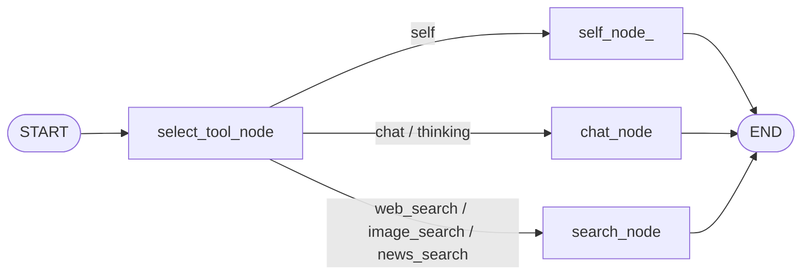

# 12 — AI Pipeline (LangGraph)

[← Back to Index](index.md)

The pipeline is the heart of the chat feature. It is a **LangGraph `StateGraph`** that takes a user query, decides which "service" handles it, runs that node, and returns an updated state containing the answer and metrics.

## State (`src/pipelines/pipeline_state.py`)

```python
class PipelineState(TypedDict):
    service_name: str                       # "chat" | "web_search" | "image_search" | "news_search" | "self" | "thinking"
    user_input: str                         # raw user query
    llm_messages: list[dict[str, Any]]      # conversation context (Human/AI messages)
    llm_response: str | None = None         # final answer text
    input_tokens: int | None = 0
    output_tokens: int | None = 0
    response_time: float | None = 0.0
```

The router (chat handler) seeds `service_name`, `user_input`, and `llm_messages`; nodes fill in the rest.

## Graph definition (`src/pipelines/builder.py`)

```python
builder = StateGraph(PipelineState)

builder.add_node("select_tool_node", select_tool_node)
builder.add_node("chat_node", chat_node)
builder.add_node("search_node", search_node)
builder.add_node("self_node_", self_node)

builder.add_edge(START, "select_tool_node")
builder.add_conditional_edges(
    "select_tool_node",
    lambda state: state["service_name"],     # routing key
    {
        "self":         "self_node_",
        "chat":         "chat_node",
        "web_search":   "search_node",
        "thinking":     "chat_node",
        "image_search": "search_node",
        "news_search":  "search_node",
    },
)
builder.add_edge("self_node_", END)
builder.add_edge("chat_node", END)
builder.add_edge("search_node", END)

pipeline = builder.compile()
```



## Nodes (`src/pipelines/nodes.py`)

### `select_tool_node` — router
Decides the service when not already explicitly set by the client:
```python
SEARCH_PATTERN = r"\b(current|now|today|latest|news|weather|price|stock|exchange rate|score|live|who is)\b"
SELF_PATTERN   = r"\b(who are you|what are you|tell me about you|what is your name|who is you)\b"
```
Logic:
1. If `service_name` already in `{web_search, image_search, news_search}` → return unchanged (client explicitly chose a search mode).
2. If the query matches `SELF_PATTERN` → set `service_name = "self"`.
3. Else if it matches `SEARCH_PATTERN` → set `service_name = "web_search"`.
4. Else leave as-is (typically `chat`).

> Note: a `logger.critical("test error")` debugging line is present in this node but **commented out**. Do not uncomment in production — it would trigger an email alert on every request via the SMTP handler.

### `chat_node` — plain LLM answer
```python
start = time.perf_counter()
response = await llm_model.ainvoke(state["llm_messages"])   # full conversation context
end = time.perf_counter()
parsed = parse_response(response)
state["llm_response"]  = parsed.content
state["response_time"] = round(end - start, 3)
# token usage from parsed.response_metadata if available
```
Handles `chat` and `thinking` services. This is the only node that receives the **full message history** (`llm_messages`); search/self nodes build a single prompt.

### `search_node` — grounded answers (web/image/news)
For the active `service_name`:
- **`web_search`** — `DDGS().text(...)` (5 results). Joins result bodies/titles into `web_content`, formats up to 5 source links, fills `WEB_SEARCH_PROMPT`. If no results, falls back to a plain LLM answer.
- **`image_search`** — `DDGS().images(...)` (4 results, filters out `zhidao` URLs), fills `IMAGE_SEARCH_PROMPT`, appends "Related Images Links".
- **`news_search`** — `DDGS().news(...)` (5 results), fills `NEWS_SEARCH_PROMPT`, appends sources.

Then invokes the LLM with the constructed prompt, records timing/tokens, and sets:
```python
state["llm_response"] = parsed_response.content.strip() + links_section
```
On any exception it logs the error and falls back to a direct LLM answer on the raw query. **The appended `links_section` is what the streaming endpoint reconciles as the trailing "diff".**

### `self_node` — identity
Fills `SELF_PROMPT` (assistant introduces itself as **SannaAI**, created by Akash Gaur), invokes the LLM, records metrics, and returns. Used for "who are you?"-type queries.

## How the router (chat handler) drives the pipeline

Non-streaming:
```python
response = await pipeline.ainvoke({
    "service_name": service_name,
    "user_input": user_prompt,
    "llm_messages": llm_messages,    # last 5 turns + current message
})
assistant_content = response["llm_response"]
```

Streaming uses `pipeline.astream_events(..., version="v2")` and reacts to event kinds:
- `on_chat_model_stream` → forward token chunks to the client.
- `on_chat_model_end` → capture `usage_metadata` (tokens).
- `on_chain_end` → capture the final `llm_response` (including appended links).

See [03 — Data Flow](03-system-design-and-data-flow.md) for full sequence diagrams.

## Prompt templates (`src/prompts/prompts.py`)

| Template | Inputs | Purpose |
|----------|--------|---------|
| `WEB_SEARCH_PROMPT` | `web_content`, `user_input` | Answer grounded in web text |
| `IMAGE_SEARCH_PROMPT` | `img_title`, `thumbnail_url`, `user_input` | Answer using image search context |
| `NEWS_SEARCH_PROMPT` | `news_title`, `image`, `news_date`, `news_source`, `user_input` | Answer using news context |
| `SELF_PROMPT` | `user_input` | Identity / self-inquiry responses as "SannaAI" |

## Extending the pipeline

- **Add a service:** create a node function `async def my_node(state)`, register it in `builder.py` (`add_node` + a key in the conditional edges map + an edge to `END`), and add the service to `SUPPORTED_SERVICES` in `config.yml`.
- **Smarter routing:** the commented-out `select_tool_node` variant shows an LLM-based router ("Does this query require real-time web search? yes/no"). You can swap the regex router for it.
- **Visualize:** run `python scripts/generate_pipeline_graphs.py` to render the graph to `artifacts/main_pipeline.png`, or `scripts/pipeline_summary.py` for node/edge counts.

---

Next: [13 — Error Handling & Logging →](13-logging-and-error-handling.md)
