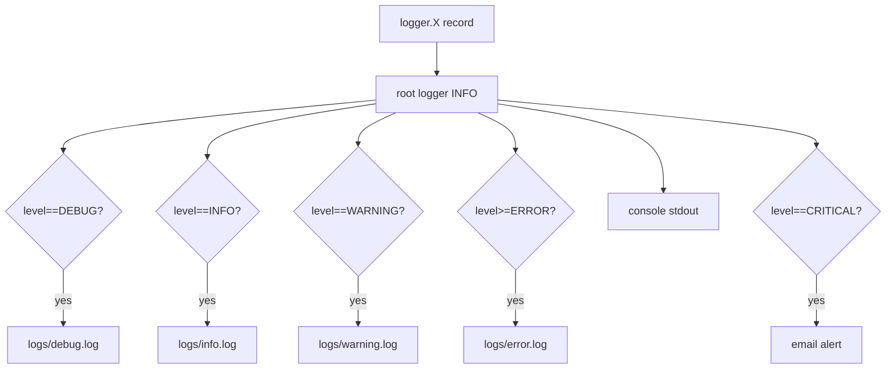

# 13 — Error Handling & Logging

[← Back to Index](index.md)

## Logging architecture

Logging is configured **declaratively** via `src/config/logging.yaml` and applied by `setup_logging()` (`src/logger.py`). This is called **first thing** in `main.py`, before importing any module that logs at import time.

```python
# main.py
from src.logger import setup_logging
setup_logging()                 # before other imports
logger = logging.getLogger(__name__)
```

### `setup_logging()` (`src/logger.py`)
```python
def setup_logging(config_path="src/config/logging.yaml"):
    os.makedirs("logs", exist_ok=True)
    with open(config_path) as f:
        config = yaml.safe_load(f)
    # inject SMTP creds at runtime (never stored in YAML)
    config["handlers"]["email"]["credentials"] = [os.getenv("SENDER_EMAIL"), os.getenv("SENDER_PASSWORD")]
    config["handlers"]["email"]["fromaddr"]    = os.getenv("SENDER_EMAIL")
    config["handlers"]["email"]["toaddrs"]     = [os.getenv("TEST_EMAIL")]
    logging.config.dictConfig(config)
```

### `ExactLevelFilter`
A custom `logging.Filter` that passes **only** records whose `levelno` equals a target level. This is what makes "one file per level" possible:
```python
class ExactLevelFilter(logging.Filter):
    def __init__(self, level): self.level = level
    def filter(self, record): return record.levelno == self.level
```

## Handlers (`logging.yaml`)

| Handler | Level | Filter | Destination | Rotation |
|---------|-------|--------|-------------|----------|
| `debug_file` | DEBUG | exact 10 | `logs/debug.log` | 10 MB × 5 |
| `info_file` | INFO | exact 20 | `logs/info.log` | 10 MB × 5 |
| `warning_file` | WARNING | exact 30 | `logs/warning.log` | 10 MB × 5 |
| `error_file` | ERROR | — (ERROR+) | `logs/error.log` | 10 MB × 5 |
| `console` | DEBUG | — | stdout | — |
| `email` | CRITICAL | exact 50 | SMTP (Gmail) | — |

- The **root logger** is `INFO` and attaches all handlers. Because of the exact-level filters, an INFO record lands in `info.log` only; a WARNING in `warning.log` only; ERROR+ in `error.log`; CRITICAL also triggers an email.
- **Formatters:** `standard` (`%(asctime)s [%(levelname)s] %(name)s: %(message)s`) for files/console; `email_formatter` (multi-line with file/line/function) for alerts.
- **Noisy third-party loggers** (`httpx`, `gunicorn`, `uvicorn`, `uvicorn.access`, `primp`, `mcp.client.sse`, `langchain_aws.chat_models.bedrock_converse`) are pinned to `WARNING`/`ERROR` via a YAML anchor (`&noisy`).

> ℹ️ **CRITICAL ⇒ email.** Any `logger.critical(...)` sends an email via the SMTP handler. A leftover `logger.critical("test error")` in `select_tool_node` has been commented out — restore it only intentionally.

> ℹ️ **Doc vs. code note:** `config.yml` also has a `Logging:` block (filenames like `aichatapp-info.log`, format string, `NOISY_LOGGERS`). The **active** configuration is `logging.yaml` (used by `dictConfig`); the `config.yml` `Logging` block is legacy from the previous code-based setup and is not what drives runtime logging now.

## Logging flow



---

## Error-handling strategy

The app uses several complementary patterns:

### 1. HTTP errors via `HTTPException`
Route handlers raise `fastapi.HTTPException(status_code, detail)` for client-facing errors (validation, not found, auth). FastAPI serializes these to `{"detail": "..."}`. Examples:
- `400` invalid ObjectId / unsupported service / duplicate email / OTP errors.
- `401` invalid credentials / bad token (`get_current_user`).
- `403` RBAC failure (`RoleChecker`).
- `404` user/conversation not found.
- `500` email send failure.

### 2. Pydantic validation (automatic)
Invalid request bodies are rejected with `422` and a structured error before the handler runs (e.g. password < 6 chars, missing `user_query`).

### 3. Graceful degradation in the pipeline
`search_node` wraps its logic in `try/except`: if web/image/news search fails, it logs the error and **falls back** to a plain LLM answer on the raw query — the user still gets a response. Similarly, "no results" for web search degrades to a direct answer.

### 4. Best-effort title generation
`generate_chat_title` catches all exceptions and falls back to `user_query[:30]`, so title failures never break a chat turn.

### 5. Streaming error frames
The streaming generator catches exceptions and emits an SSE `error` frame (`{"type":"error","detail":...}`) rather than dropping the connection silently. DB-save failures during streaming emit a separate error frame after the content was already streamed.

### 6. Email send failures
`send_otp_email` catches exceptions, prints the error, and returns `False`; the route then raises `500`.

## Where errors are logged
- `nodes.py` — `logger.error(...)` on search failures.
- `chat_router.py` — `logger.error(..., exc_info=True)` on streaming and DB-save errors.
- `utils.py` — `logger.error(..., exc_info=True)` on title-generation failures.

## Gaps & recommendations
- There is **no global exception handler** (`@app.exception_handler`) — unhandled exceptions return FastAPI's default 500 with no custom body. Consider adding one for consistent error envelopes and to log stack traces centrally.
- `send_otp_email` uses `print(...)` instead of the logger — route it through `logger.error` for consistency.
- ~~Gate or remove the `logger.critical("test error")` in `select_tool_node`.~~ **Resolved** — the line is now commented out in `select_tool_node`.

---

Next: [14 — Security Considerations →](14-security.md)
