# Architecture Diagrams

**AIChatApp** is a production-ready AI chat backend built with FastAPI, LangGraph, and MongoDB. It
exposes REST + SSE endpoints for real-time chat and web search, authenticates users via JWT,
persists conversation history in MongoDB, and routes requests through a LangGraph state-machine
pipeline that dispatches to any of nine configurable LLM providers (Ollama, vLLM, Groq, AWS
Bedrock, Google Gemini, NVIDIA, HuggingFace, llama.cpp, OpenRouter) or DuckDuckGo search.

---

## Contents

1. [System Architecture](#1-system-architecture)
2. [Component Layering and Dependency Direction](#2-component-layering-and-dependency-direction)
3. [Authentication Flow](#3-authentication-flow)
4. [Chat Request Flow (Non-Streaming)](#4-chat-request-flow-non-streaming)
5. [Streaming Chat Flow (SSE)](#5-streaming-chat-flow-sse)
6. [LangGraph Pipeline Flowchart](#6-langgraph-pipeline-flowchart)
7. [LLM Provider Factory Pattern](#7-llm-provider-factory-pattern)
8. [Data Model (MongoDB Collections)](#8-data-model-mongodb-collections)
9. [Deployment Topology](#9-deployment-topology)

---

## 1. System Architecture

Shows the top-level containers: the FastAPI backend, MongoDB database, and every external service
the app talks to (LLM providers, DuckDuckGo search, Gmail SMTP).

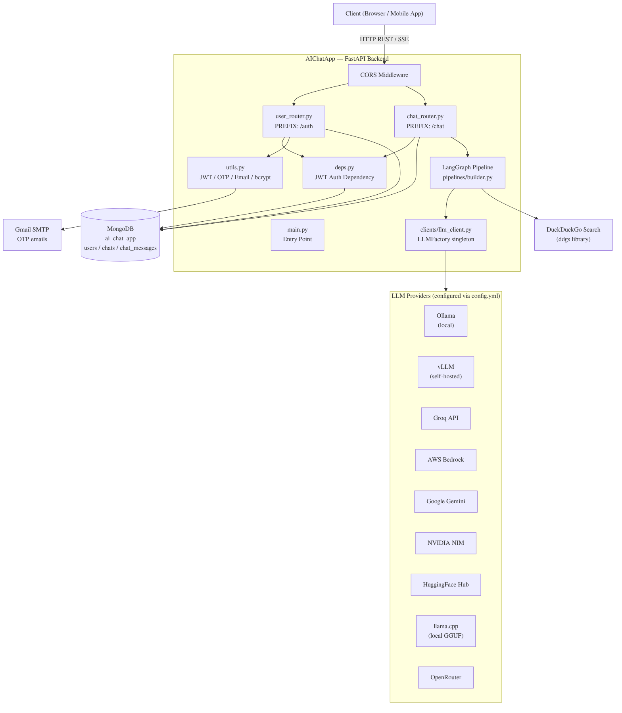

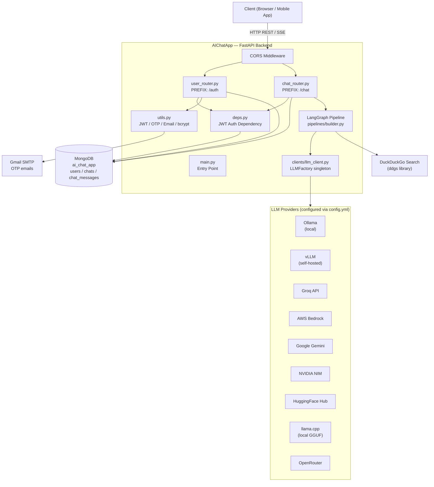

---

## 2. Component Layering and Dependency Direction

Maps the four layers of the codebase — Presentation (API routes), Application (business logic and
pipeline), Infrastructure (database + LLM clients), and Configuration — and shows which modules
import which.

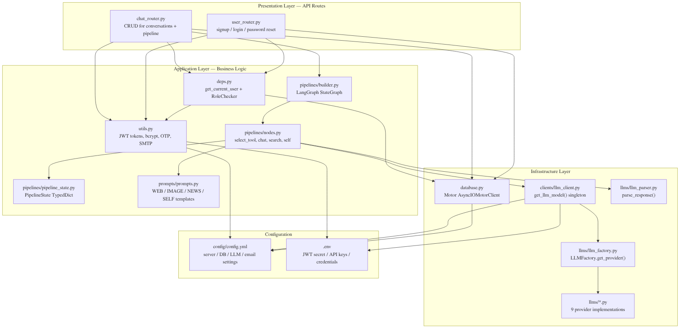

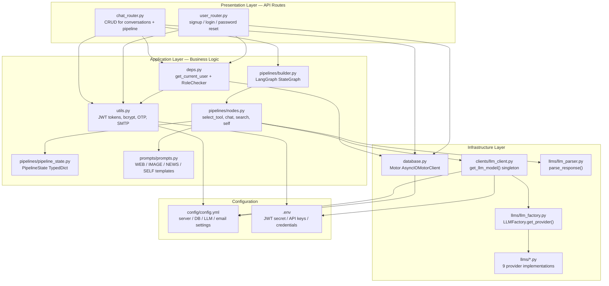

---

## 3. Authentication Flow

Covers all three user-auth paths: Signup, Login (OAuth2PasswordRequestForm + JSON variants),
and the Forgot Password → OTP → Reset flow. JWT tokens are HS256, signed with `JWT_SECRET_KEY`,
and expire after 6 hours (configurable). Passwords are hashed with bcrypt.

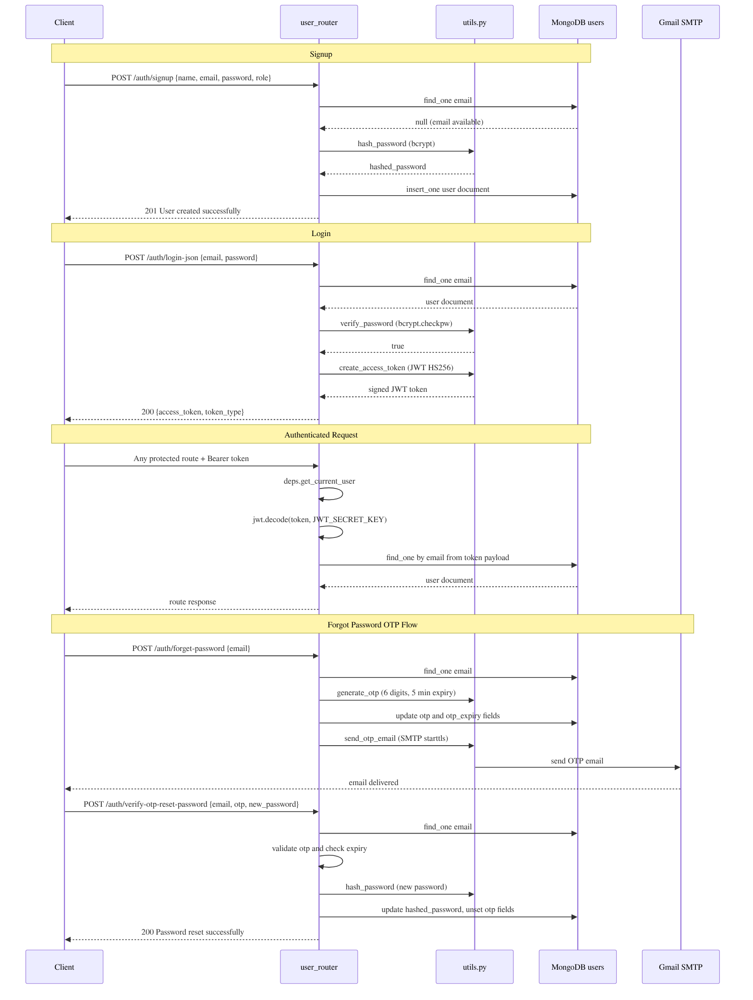

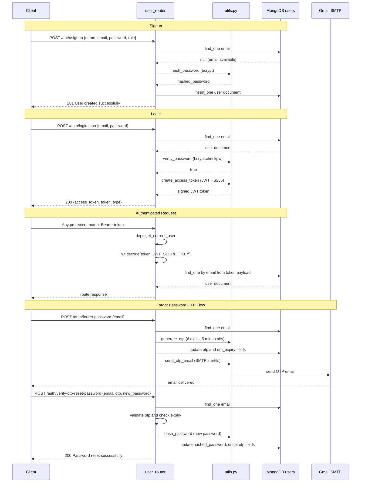

---

## 4. Chat Request Flow (Non-Streaming)

Traces a full non-streaming chat request through JWT validation, conversation history loading
(last 5 turns), the LangGraph pipeline, LLM inference, and dual-path MongoDB persistence
(new vs. existing conversation). Entry point: `chat_router.py:execute_user_query` (line 49).

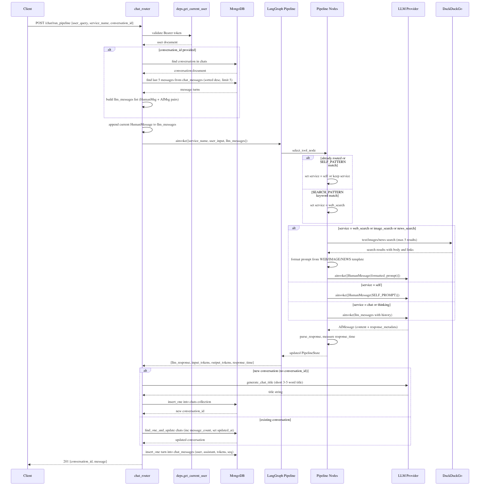

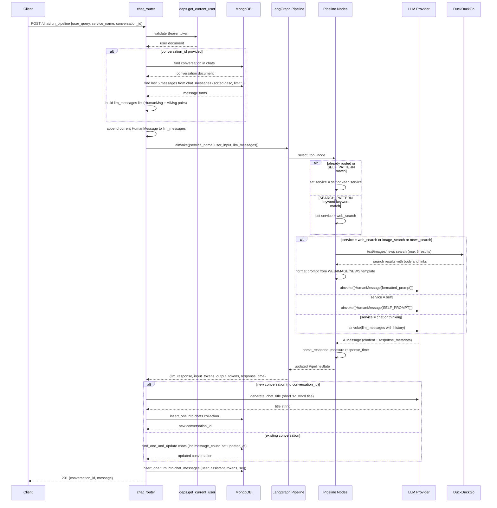

---

## 5. Streaming Chat Flow (SSE)

Shows how the streaming endpoint (`POST /chat/run_pipeline/stream`) uses
`pipeline.astream_events()` to forward token chunks as Server-Sent Events while deferring
MongoDB writes until the stream completes. Entry point: `chat_router.py:execute_user_query_streaming`
(line 152).

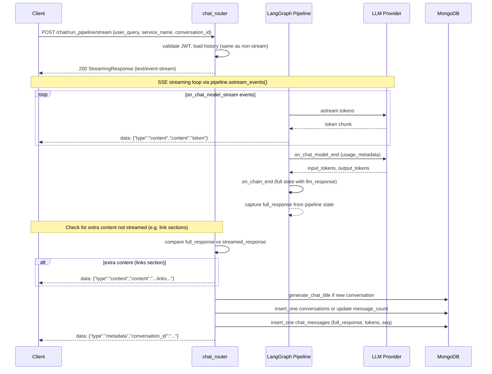

---

## 6. LangGraph Pipeline Flowchart

Traces the LangGraph `StateGraph` compiled in `pipelines/builder.py`. The routing logic in
`select_tool_node` (nodes.py:43) inspects the incoming `service_name` and two regex patterns
(`SEARCH_PATTERN`, `SELF_PATTERN`) to decide which downstream node handles the request.

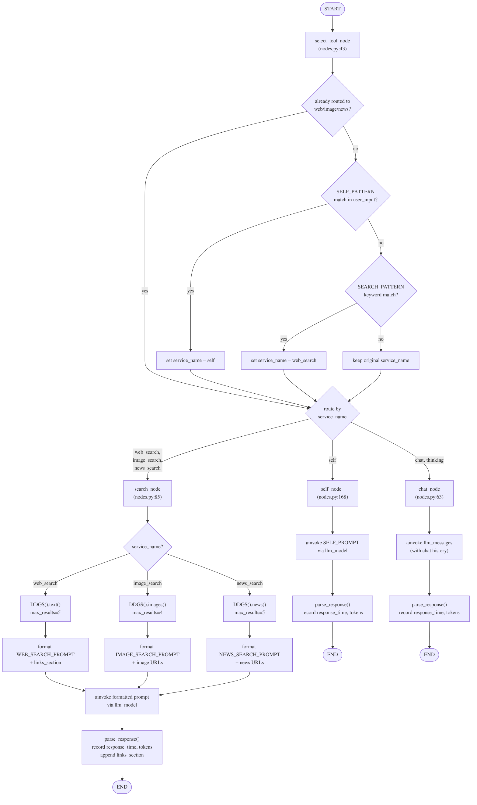

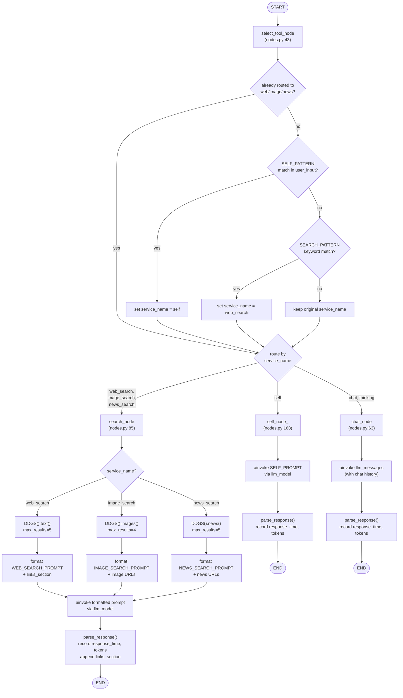

---

## 7. LLM Provider Factory Pattern

`LLMFactory` (llms/llm_factory.py) maps a string key from `config.yml` → `LLM.Provider` to a
concrete `BaseLLMProvider` subclass. `get_llm_model()` in `clients/llm_client.py` resolves the
singleton at startup; all pipeline nodes share the same instance.

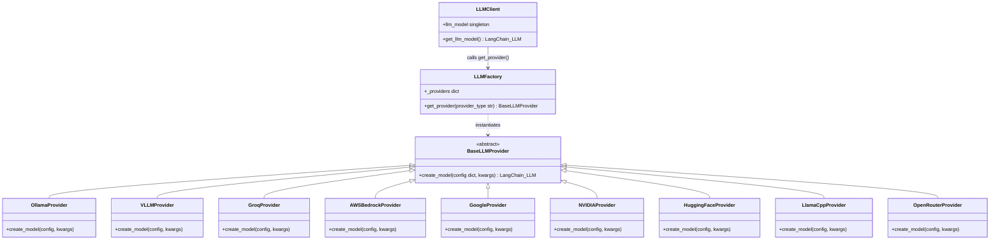

---

## 8. Data Model (MongoDB Collections)

Three MongoDB collections in the `ai_chat_app` database. `chat_id` in `chat_messages` is stored
as a string (str(ObjectId)) — not a native ObjectId — matching the pattern in chat_router.py
lines 115 and 139.

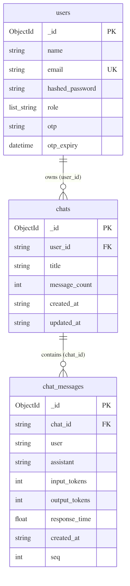

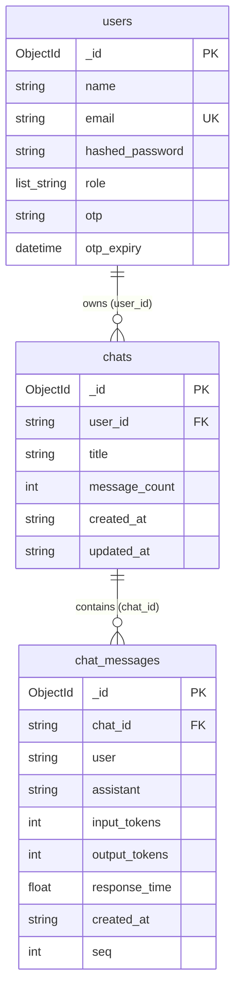

---

## 9. Deployment Topology

Shows both runtime modes — Development (Uvicorn single-process with `--reload`) and Production
(Gunicorn managing 2 UvicornWorkers) — and how each tier connects to MongoDB, LLM APIs, and
external services.

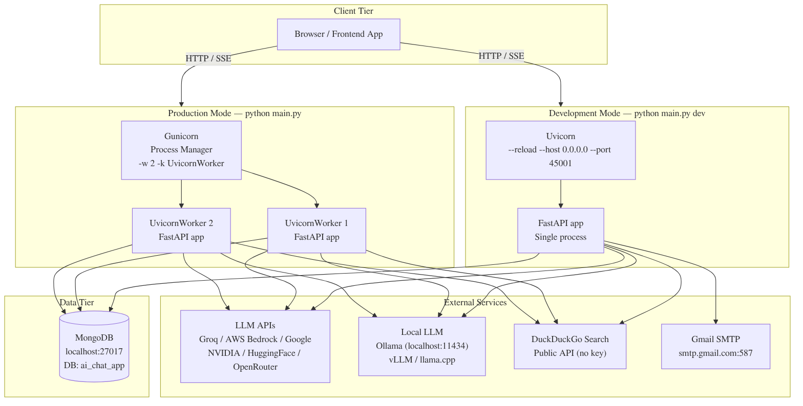

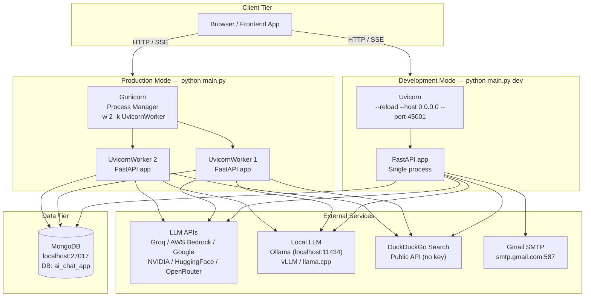
